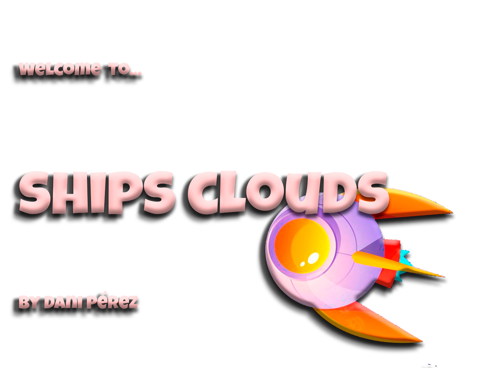

# Game name

Title: Ships clouds

[]

## Description
It's a dynamic game in which you can shoot and dodge the enemies, you can also get hearts to keep playing, be careful not to collide with enemy ships !!!!

## User stories MVP

Minimum user stories:
- User can press the button to start the game.
- User can move the ship in all directions
- User cannot leave the game area

## User stories Backlog  

- User can recover life
- User can on / off sound
- User can choose the ships
- User can choose the songs
- User can crash the enemies
- User can shot
- User can game over

## File structure

- <code>game.js</code>: contains all the elements for the game to work. Methods: start(), \_update()
- <code>scripts.js</code>: contains all the DOM manipulation code to start the game
- <code>player.js</code>: contains the elements to create and move the player.
 Methods :moveUp(),  moveLeft(),  moveRight(),  moveDown().
 - <code>enemies.js</code>:contains the elements to create and move the enemires.
 Methods: _speed().
 - <code>shot.js</code>:contains the elements to create and move the bullets.
Methods:moveLeft(),  moveRight(),
<code>bomms.j</code>:contains the array elements to create the images explosions.
<code>extaLife.js</code>
## Useful links

<!-- When you finish, add these links and commit -->

- [Presentation slides]()
- [Deployed game]()
